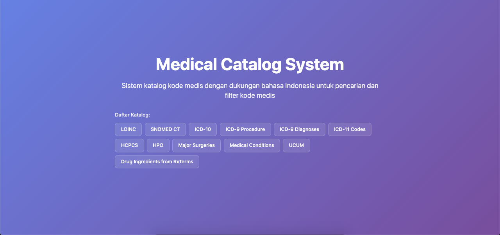
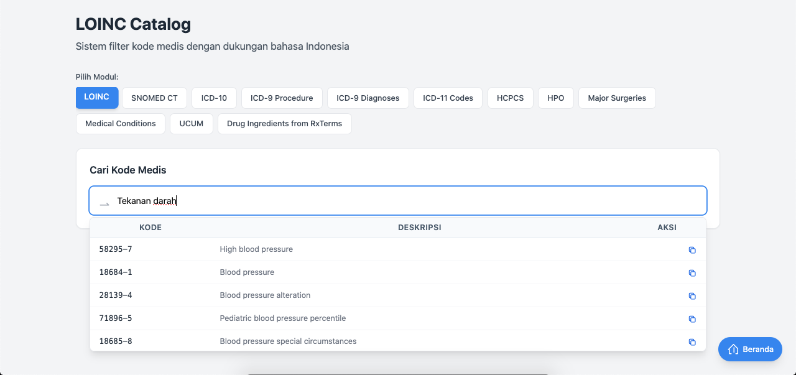

# Catalog Medical - Medical Code Catalog System

A comprehensive web-based medical catalog system with Indonesian language support for searching and filtering medical codes from multiple medical terminologies.

## Features

- **LOINC Catalog**: Search and browse Logical Observation Identifiers Names and Codes (REST API or MySQL database)
- **SNOMED-CT Catalog**: Search and browse Systematized Nomenclature of Medicine Clinical Terms (MySQL database)
- **KFA Catalog**: Search and browse Farmaceutical Product Catalog - Master KFA (MySQL database)
- **ICD-10 Catalog**: Search and browse International Classification of Diseases, 10th Revision (REST API)
- **ICD-11 Codes Catalog**: Search and browse International Classification of Diseases, 11th Revision (REST API)
- **ICD-9 Procedure Catalog**: Search and browse International Classification of Diseases, 9th Revision, Clinical Modification - Procedures (REST API)
- **ICD-9 Diagnoses Catalog**: Search and browse International Classification of Diseases, 9th Revision, Clinical Modification - Diagnoses (REST API)
- **HCPCS Catalog**: Search and browse Healthcare Common Procedure Coding System (REST API)
- **HPO Catalog**: Search and browse Human Phenotype Ontology (REST API)
- **Major Surgeries and Implants Catalog**: Search and browse major surgeries and implants procedures (REST API)
- **Medical Conditions Catalog**: Search and browse medical conditions from Regenstrief Institute Medical Gopher program (REST API)
- **UCUM Catalog**: Search and browse The Unified Code for Units of Measure (REST API)
- **RxTerms Catalog**: Search and browse Prescribable Drug Ingredients from RxTerms (REST API)
- **Indonesian Language Support**: Filter and search using Indonesian terminology with Google Translate API
- **Responsive Design**: Modern UI with Tailwind CSS
- **Enhanced Search Results**: SNOMED-CT results include Clinical Focus column
- **Click-to-Copy**: Click any row to copy LOINC/SNOMED code to clipboard
- **Table-style Autocomplete**: Dropdown shows results in table format with Kode, Deskripsi, and Salin columns

## Demo Screenshots

<div align="center">

| Home Page LOINC | Home Page SNOMED |
|-----------|-------------|
|  |  |

</div>

## Data Sources

| Module | Source | Description |
|--------|--------|-------------|
| LOINC | REST API or MySQL Database | Configurable via `use_database` setting in config |
| SNOMED-CT | [MySQL Database](database/sql/snomed_db.sql) | SNOMED-CT database schema with local MySQL storage |
| KFA | [MySQL Database](database/sql/master_kfa.sql) | Farmaceutical Product Catalog (Master KFA) with 24,333 products |
| ICD-10 | Clinical Tables API | https://clinicaltables.nlm.nih.gov/api/icd10cm/v3/ |
| ICD-11 | Clinical Tables API | https://clinicaltables.nlm.nih.gov/api/icd11_codes/v3/ |
| ICD-9 Procedure | Clinical Tables API | https://clinicaltables.nlm.nih.gov/api/icd9cm_sg/v3/ |
| ICD-9 Diagnoses | Clinical Tables API | https://clinicaltables.nlm.nih.gov/api/icd9cm_dx/v3/ |
| HCPCS | Clinical Tables API | https://clinicaltables.nlm.nih.gov/api/hcpcs/v3/ |
| HPO | Clinical Tables API | https://clinicaltables.nlm.nih.gov/api/hpo/v3/ |
| Major Surgeries | Clinical Tables API | https://clinicaltables.nlm.nih.gov/api/procedures/v3/ |
| Medical Conditions | Clinical Tables API | https://clinicaltables.nlm.nih.gov/api/conditions/v3/ |
| UCUM | Clinical Tables API | https://clinicaltables.nlm.nih.gov/api/ucum/v3/search |
| RxTerms | Clinical Tables API | https://clinicaltables.nlm.nih.gov/api/drug_ingredients/v3/ |

## Requirements

- PHP 7.3+ (XAMPP recommended)
- MySQL 5.7+ (for SNOMED-CT and KFA modules)
- Apache HTTP Server
- Internet connection (for API access)

## Installation

### 1. Clone/Download the Project

```bash
cd /Applications/XAMPP/xamppfiles/htdocs/
# Extract or clone the project to catalog_medical directory
```

### 2. Start XAMPP Services

Start Apache and MySQL services from XAMPP Control Panel.

### 3. Create Databases (SNOMED-CT and KFA)

```sql
CREATE DATABASE IF NOT EXISTS snomed_db;
CREATE DATABASE IF NOT EXISTS master_kfa;
```

### 4. Import Database Schemas

The database SQL files are located in the `database/sql/` directory:
- `database/sql/snomed_db.sql` - SNOMED-CT database schema
- `database/sql/master_kfa.sql` - KFA (Master KFA) database schema with 24,333 products

```bash
# Import SNOMED-CT schema
mysql -u root -p snomed_db < database/sql/snomed_db.sql

# Import KFA schema
mysql -u root -p master_kfa < database/sql/master_kfa.sql
```

**Note**: Most modules use REST API from clinicaltables.nlm.nih.gov and do not require a local database.

### 5. Configure Database Connections

Edit the configuration files to match your environment:

**`modules/snomed/config.php`** (for SNOMED-CT):
```php
'db' => [
    'host' => '127.0.0.1',
    'port' => 3306,
    'dbname' => 'snomed_db',
    'username' => 'root',
    'password' => '',
    'charset' => 'utf8'
],
```

**`modules/kfa/config.php`** (for KFA):
```php
'db' => [
    'host' => '127.0.0.1',
    'port' => 3306,
    'dbname' => 'master_kfa',
    'username' => 'root',
    'password' => '',
    'charset' => 'utf8'
],
```

### 6. Access the Application

Open your browser and navigate to:
```
http://localhost/catalog_medical/public/
```

## Project Structure

```
catalog_medical/
├── config/
│   └── modules.php              # Main module configuration
├── database/
│   └── sql/
│       ├── snomed_db.sql        # SNOMED-CT database schema
│       └── loinc_db.sql         # LOINC database schema (optional)
├── docs/
│   └── API documentation files  # API documentation for each module
├── modules/
│   ├── ModuleRegistry.php       # Module registry class
│   ├── MedicalCatalogModule.php # Unified catalog module
│   ├── Translator.php           # Indonesian-English translator
│   ├── loinc/
│   │   ├── config.php           # LOINC configuration
│   │   ├── LoincModule.php      # LOINC module class
│   │   ├── LoincSearch.php      # LOINC search functionality
│   │   ├── LoincApi.php         # LOINC API client
│   │   └── LoincDbSearch.php    # LOINC database search
│   ├── snomed/
│   │   ├── config.php           # SNOMED-CT configuration
│   │   ├── SnomedModule.php     # SNOMED-CT module class
│   │   └── SnomedSearch.php     # SNOMED-CT search functionality
│   ├── kfa/
│   │   ├── config.php           # KFA configuration
│   │   ├── KfaModule.php        # KFA module class
│   │   └── KfaSearch.php        # KFA search functionality
│   ├── icd10/
│   │   ├── config.php           # ICD-10 configuration
│   │   ├── IcdModule.php        # ICD-10 module class
│   │   └── IcdSearch.php        # ICD-10 search functionality
│   ├── icd11_codes/
│   │   ├── config.php           # ICD-11 configuration
│   │   ├── Icd11Module.php      # ICD-11 module class
│   │   └── Icd11Search.php      # ICD-11 search functionality
│   ├── icd9_procedure/
│   │   ├── config.php           # ICD-9 Procedure configuration
│   │   ├── Icd9ProcedureModule.php
│   │   ├── Icd9ProcedureSearch.php
│   │   └── Icd9ProcedureApi.php
│   ├── icd9_diagnose/
│   │   ├── config.php           # ICD-9 Diagnoses configuration
│   │   ├── Icd9DiagnoseModule.php
│   │   ├── Icd9DiagnoseSearch.php
│   │   └── Icd9DiagnoseApi.php
│   ├── hcpcs/
│   │   ├── config.php           # HCPCS configuration
│   │   ├── HcpcsModule.php      # HCPCS module class
│   │   ├── HcpcsSearch.php      # HCPCS search functionality
│   │   └── HcpcsApi.php         # HCPCS API client
│   ├── hpo/
│   │   ├── config.php           # HPO configuration
│   │   ├── HpoModule.php        # HPO module class
│   │   ├── HpoSearch.php        # HPO search functionality
│   │   └── HpoApi.php           # HPO API client
│   ├── major_surgeries_and_implants/
│   │   ├── config.php           # Major Surgeries configuration
│   │   ├── MajorSurgeriesModule.php
│   │   ├── MajorSurgeriesSearch.php
│   │   └── MajorSurgeriesApi.php
│   ├── medical_conditions/
│   │   ├── config.php           # Medical Conditions configuration
│   │   ├── MedicalConditionsModule.php
│   │   ├── MedicalConditionsSearch.php
│   │   └── MedicalConditionsApi.php
│   ├── ucum/
│   │   ├── config.php           # UCUM configuration
│   │   ├── UcumModule.php       # UCUM module class
│   │   ├── UcumSearch.php       # UCUM search functionality
│   │   └── UcumApi.php          # UCUM API client
│   └── prescribable_drug_ingredients_RxTerms/
│       ├── config.php           # RxTerms configuration
│       ├── RxTermsModule.php    # RxTerms module class
│       ├── RxTermsSearch.php    # RxTerms search functionality
│       └── RxTermsApi.php       # RxTerms API client
├── public/
│   ├── index.php                # Landing page (hero section, features)
│   ├── catalog.php              # Main catalog interface (search, results)
│   └── assets/
│       └── css/
│           └── style.css        # Custom styles
├── screenshoot/
│   ├── screenshoot_1.png        # Home page LOINC screenshot
│   └── screenshoot_2.png        # Home page SNOMED screenshot
└── README.md                    # This file
```

## Usage

### Home Page
Displays quick search form with autocomplete suggestions.

### Search Page
- Search by keyword (e.g., "darah", "glukosa", "urine")
- Results are automatically translated from Indonesian to English
- Sortable and paginated tables
- Real-time autocomplete suggestions

### Statistics Page
View database statistics for each module.

## LOINC API Features

The LOINC module uses the REST API from `clinicaltables.nlm.nih.gov` with the following capabilities:

### Search Types
- **Questions**: Search individual LOINC questions
- **Forms**: Search LOINC forms and panels
- **Forms and Sections**: Search forms with their sections

### API Endpoints
| Endpoint | Description |
|----------|-------------|
| `/api/loinc_items/v3/search` | Search LOINC questions |
| `/loinc_answers` | Get answer lists for questions |
| `/loinc_form_definitions` | Get form definitions |

### Query Parameters
- `terms`: Search string
- `type`: Result type (question, form, panel, form_and_section)
- `count`: Number of results (max 500)
- `offset`: Pagination offset
- `q`: Additional query filters (e.g., `STATUS:ACTIVE`)
- `available`: Filter available forms
- `ef`: Extra fields to return
- `df`: Display fields
- `sf`: Search fields
- `cf`: Code field
- `excludeCopyrighted`: Exclude copyrighted content

## Configuration Options

### Module Settings
- `default_module`: Default catalog module (loinc/snomed)
- `app.name`: Application name
- `app.version`: Application version
- `app.debug`: Debug mode

### Search Settings
- `default_limit`: Default number of search results
- `max_limit`: Maximum results limit
- `enable_translation`: Enable Indonesian-English translation

## API Endpoints

| Endpoint | Description |
|----------|-------------|
| `/index.php` | Landing page |
| `/catalog.php?page=home&module=loinc` | LOINC home page |
| `/catalog.php?page=home&module=snomed` | SNOMED-CT home page |
| `/catalog.php?page=home&module=kfa` | KFA home page |
| `/catalog.php?page=search&module=loinc&q=<term>` | Search LOINC |
| `/catalog.php?page=search&module=snomed&q=<term>` | Search SNOMED-CT |
| `/catalog.php?page=search&module=kfa&q=<term>` | Search KFA |
| `/catalog.php?page=stats&module=loinc` | LOINC statistics |
| `/catalog.php?page=stats&module=snomed` | SNOMED-CT statistics |
| `/catalog.php?page=stats&module=kfa` | KFA statistics |
| `/catalog.php?ajax=autocomplete&module=loinc&q=<term>` | Autocomplete suggestions |

## Troubleshooting

### API Connection Error
If you see "API connection failed" error:
1. Ensure internet connection is available
2. Check if `clinicaltables.nlm.nih.gov` is accessible
3. Verify firewall/proxy settings

### Database Connection Error (SNOMED-CT)
If you see "No such file or directory" error:
1. Ensure MySQL is running
2. Use `127.0.0.1` instead of `localhost` in config files
3. Verify port 3306 is correct

### Character Set Error
If you see "Unknown character set" error:
1. Change `charset` from `utf8mb4` to `utf8` in config files
2. The application will use `SET NAMES utf8mb4` after connection

## Technology Stack

- **Backend**: PHP 7.3+
- **Database**: MySQL 5.7+ (SNOMED-CT and KFA modules)
- **Frontend**: HTML5, CSS3, JavaScript (Tailwind CSS, jQuery)
- **Translation**: Google Translate API
- **API Client**: cURL for REST API calls

## License

This project is for educational and medical reference purposes.

## Contributing

1. Fork the repository
2. Create a feature branch
3. Make your changes
4. Submit a pull request

## Contact

For issues and feature requests, please use the project's issue tracker.