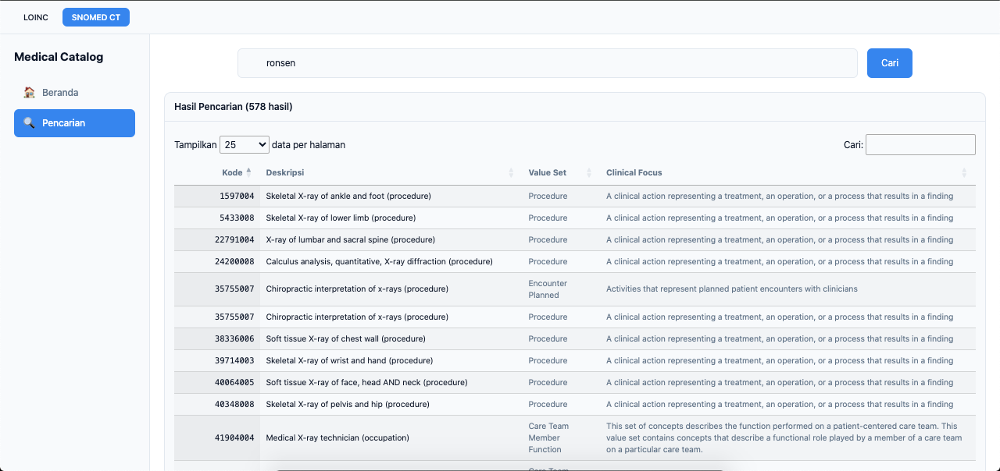
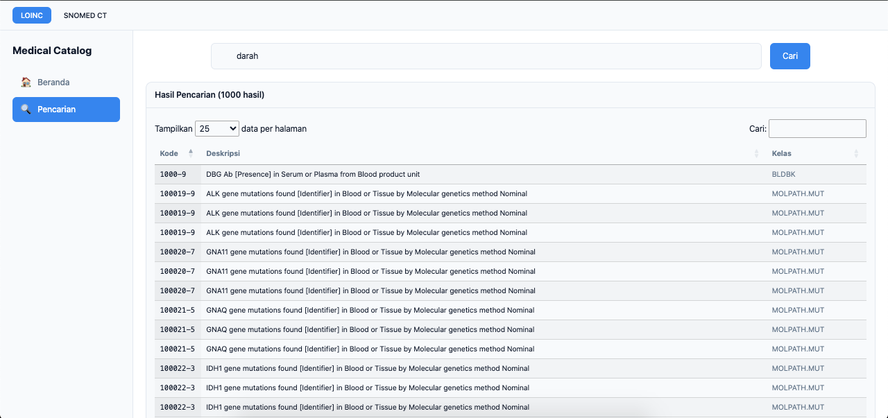

# Catalog LOINC & SNOMED-CT

A web-based medical catalog system with Indonesian language support for searching and filtering LOINC and SNOMED-CT medical codes.

## Features

- **LOINC Catalog**: Search and browse Logical Observation Identifiers Names and Codes
- **SNOMED-CT Catalog**: Search and browse Systematized Nomenclature of Medicine Clinical Terms
- **Indonesian Language Support**: Filter and search using Indonesian terminology with Google Translate API
- **Responsive Design**: Modern UI with Tailwind CSS
- **DataTables Integration**: Advanced table features with sorting, pagination, and search
- **Dashboard Statistics**: Quick stats on home page showing record counts
- **Enhanced Search Results**: SNOMED-CT results include Clinical Focus column

## Demo Screenshots

<div align="center">

| Home Page | Search Page |
|-----------|-------------|
|  |  |

| Statistics Page | LOINC Module |
|-----------------|----------------|
|  |  |

</div>

## Data Sources

| Module | Source | Description |
|--------|--------|-------------|
| LOINC | [loinc.org](https://loinc.org/news/loinc-version-2-82-release-highlights/) | LOINC Version 2.82 release with clinical terms and codes |
| SNOMED-CT | [Hugging Face Dataset](https://huggingface.co/datasets/awacke1/SNOMED-CT-Code-Value-Semantic-Set.csv) | SNOMED-CT Code Value Semantic Set for medical terminology |

## Requirements

- PHP 7.3+ (XAMPP recommended)
- MySQL 5.7+
- Apache HTTP Server

## Installation

### 1. Clone/Download the Project

```bash
cd /Applications/XAMPP/xamppfiles/htdocs/
# Extract or clone the project to medical_catalog directory
```

### 2. Start XAMPP Services

Start Apache and MySQL services from XAMPP Control Panel.

### 3. Create Databases

```sql
CREATE DATABASE IF NOT EXISTS loinc_db;
CREATE DATABASE IF NOT EXISTS snomed_db;
```

### 4. Import Database Schema

The database SQL files are located in the `database/sql/` directory:
- `database/sql/loinc_db.sql` - LOINC database schema
- `database/sql/snomed_db.sql` - SNOMED-CT database schema

```bash
# Import LOINC schema
mysql -u root -p loinc_db < database/sql/loinc_db.sql

# Import SNOMED-CT schema
mysql -u root -p snomed_db < database/sql/snomed_db.sql
```

### 5. Configure Database Connection

Edit the configuration files to match your environment:

**`modules/loinc/config.php`**:
```php
'db' => [
    'host' => '127.0.0.1',
    'port' => 3306,
    'dbname' => 'loinc_db',
    'username' => 'root',
    'password' => '',
    'charset' => 'utf8'
],
```

**`modules/snomed/config.php`**:
```php
'db' => [
    'host' => '127.0.0.1',
    'port' => 3306,
    'dbname' => 'snomed_db',
    'username' => 'root',
    'password' => '',
    'charset' => 'utf8'
],
```

### 6. Access the Application

Open your browser and navigate to:
```
http://localhost/medical_catalog/public/
```

## Project Structure

```
catalog_loinc/
├── config/
│   └── modules.php          # Main module configuration
├── database/
│   └── sql/
│       ├── loinc_db.sql     # LOINC database schema
│       └── snomed_db.sql    # SNOMED-CT database schema
├── modules/
│   ├── ModuleRegistry.php   # Module registry class
│   ├── loinc/
│   │   ├── config.php       # LOINC configuration
│   │   ├── LoincModule.php  # LOINC module class
│   │   ├── LoincSearch.php  # LOINC search functionality
│   │   └── Translator.php   # Indonesian-English translator
│   └── snomed/
│       ├── config.php       # SNOMED-CT configuration
│       ├── SnomedModule.php # SNOMED-CT module class
│       └── SnomedSearch.php # SNOMED-CT search functionality
├── public/
│   ├── index.php            # Main web interface
│   └── assets/
│       └── css/
│           └── style.css    # Custom styles
└── README.md
```

## Usage

### Home Page
Displays summary statistics and quick search form.

### Search Page
- Search by keyword (e.g., "darah", "glukosa", "urine")
- Results are automatically translated from Indonesian to English
- Sortable and paginated tables

### Statistics Page
View database statistics for each module.

## Configuration Options

### Module Settings
- `default_module`: Default catalog module (loinc/snomed)
- `app.name`: Application name
- `app.version`: Application version
- `app.debug`: Debug mode

### Search Settings
- `default_limit`: Default number of search results
- `max_limit`: Maximum results limit
- `enable_fulltext`: Enable full-text search

## Troubleshooting

### Database Connection Error
If you see "No such file or directory" error:
1. Ensure MySQL is running
2. Use `127.0.0.1` instead of `localhost` in config files
3. Verify port 3306 is correct

### Character Set Error
If you see "Unknown character set" error:
1. Change `charset` from `utf8mb4` to `utf8` in config files
2. The application will use `SET NAMES utf8mb4` after connection

### Missing Database
Run the SQL import scripts in `database/sql/` directory.

## API Endpoints

| Endpoint | Description |
|----------|-------------|
| `/?page=home&module=loinc` | LOINC home page |
| `/?page=home&module=snomed` | SNOMED-CT home page |
| `/?page=search&module=loinc&q=<term>` | Search LOINC |
| `/?page=search&module=snomed&q=<term>` | Search SNOMED-CT |
| `/?page=stats&module=loinc` | LOINC statistics |
| `/?page=stats&module=snomed` | SNOMED-CT statistics |

## Technology Stack

- **Backend**: PHP 7.3+
- **Database**: MySQL 5.7+
- **Frontend**: HTML5, CSS3, JavaScript (Tailwind CSS, jQuery, DataTables)
- **Translation**: Google Translate API

## License

This project is for educational and medical reference purposes.

## Contributing

1. Fork the repository
2. Create a feature branch
3. Make your changes
4. Submit a pull request

## Contact

For issues and feature requests, please use the project's issue tracker.